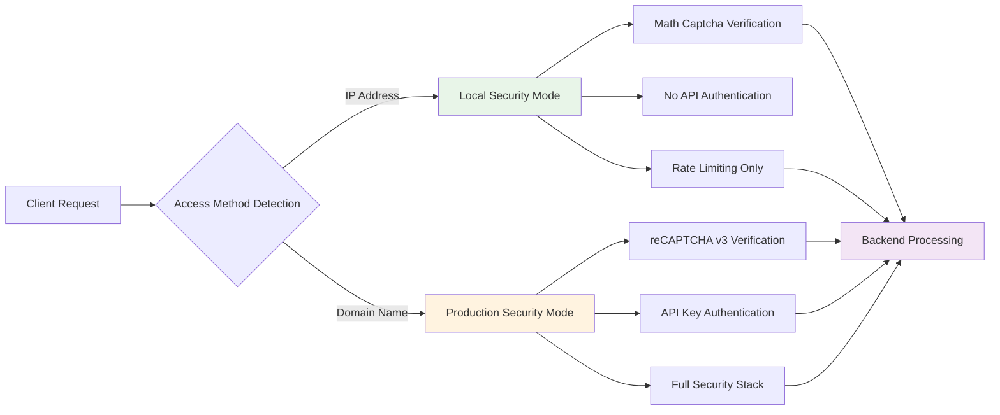

# API Documentation - **Dual Captcha Portfolio Platform**

## 🚀 **API Overview**

The Portfolio Backend API implements a **dual captcha security system** that automatically adapts security verification based on access method - local math captcha for IP-based access and Google reCAPTCHA v3 for domain-based access.

## 🔗 **Base URLs**

### **Local Access (IP-based)**
- **HTTP Direct**: `http://192.168.86.75:3001`
- **HTTPS via Kong**: `https://192.168.86.75:8443`
- **Authentication**: Not required (bypassed for IP access)
- **Captcha**: Local math captcha (e.g., "What is 7 + 3?")

### **Domain Access (Production)**
- **HTTPS via Traefik**: `https://portfolio.architecturesolutions.co.uk`
- **Authentication**: Required (`X-API-Key` header)
- **Captcha**: Google reCAPTCHA v3 (invisible background verification)

### **Preview Environment**
- **HTTPS**: `https://gateway-security.preview.emergentagent.com`
- **Authentication**: Domain-based (reCAPTCHA required)

## 🛡️ **Security Architecture**



## 📋 **API Endpoints**

### **Health Check**

#### `GET /api/health`

**Description**: System health check endpoint

**Access**: Public (no authentication required)

**Response**:
```json
{
  "status": "healthy",
  "timestamp": "2024-09-24T19:15:00Z",
  "version": "1.0.0",
  "database": "connected",
  "smtp": "configured"
}
```

**Example Requests**:
```bash
# Local HTTP access
curl -X GET http://192.168.86.75:3001/api/health

# Local HTTPS via Kong  
curl -X GET https://192.168.86.75:8443/api/health

# Domain access
curl -X GET https://portfolio.architecturesolutions.co.uk/api/health
```

---

### **Contact Form Submission**

#### `POST /api/contact/send-email`

**Description**: Submit contact form with dual captcha verification

**Rate Limit**: 5 requests per minute per IP address

**Authentication**: 
- **Local Access**: Not required
- **Domain Access**: Required (`X-API-Key` header)

#### **Request Body Schema**

```json
{
  "name": "string (2-100 characters)",
  "email": "string (valid email format)", 
  "projectType": "string",
  "budget": "string",
  "timeline": "string",
  "message": "string (1-2000 characters)",
  "recaptcha_token": "string (optional, for domain access)",
  "local_captcha": "string (optional, for IP access)"
}
```

#### **Local Access (IP-based) Request**

**Authentication**: None required

**Captcha**: Local math captcha JSON

```bash
curl -X POST http://192.168.86.75:3001/api/contact/send-email \
  -H "Content-Type: application/json" \
  -d '{
    "name": "John Doe",
    "email": "john.doe@example.com",
    "projectType": "Web Development",
    "budget": "£10,000 - £25,000",
    "timeline": "2-3 months", 
    "message": "I need help with my portfolio website.",
    "local_captcha": "{\"type\":\"local_captcha\",\"captcha_id\":\"math_123\",\"user_answer\":\"12\"}"
  }'
```

#### **Local HTTPS via Kong Request**

```bash
curl -X POST https://192.168.86.75:8443/api/contact/send-email \
  -H "Content-Type: application/json" \
  -d '{
    "name": "Jane Smith", 
    "email": "jane.smith@example.com",
    "projectType": "Cloud Migration",
    "budget": "£25,000 - £50,000",
    "timeline": "3-6 months",
    "message": "Looking for enterprise architecture consulting.",
    "local_captcha": "{\"type\":\"local_captcha\",\"captcha_id\":\"math_456\",\"user_answer\":\"8\"}"
  }'
```

#### **Domain Access Request**

**Authentication**: Required

**Captcha**: Google reCAPTCHA v3 token

```bash
curl -X POST https://portfolio.architecturesolutions.co.uk/api/contact/send-email \
  -H "Content-Type: application/json" \
  -H "X-API-Key: your-api-key-here" \
  -d '{
    "name": "Enterprise Client",
    "email": "contact@enterprise.com", 
    "projectType": "Digital Transformation",
    "budget": "£100,000+",
    "timeline": "6-12 months",
    "message": "We need comprehensive digital transformation consulting.",
    "recaptcha_token": "03AGdBq25SiXT-pmSuXGxGLXiQub2hHXvQjHlez9Hd5Q7lJ8..."
  }'
```

#### **Response Schemas**

**Success Response (200 OK)**:
```json
{
  "success": true,
  "message": "Contact form submitted successfully",
  "contact_id": "uuid-v4-string",
  "timestamp": "2024-09-24T19:15:00Z"
}
```

**Rate Limit Exceeded (429 Too Many Requests)**:
```json
{
  "detail": "Rate limit exceeded: 5 per 1 minute"
}
```

**Security Verification Failed (400 Bad Request)**:
```json
{
  "detail": "Security verification failed. Please try again."
}
```

**Authentication Failed (401 Unauthorized)**:
```json
{
  "detail": "API authentication required for domain access"
}
```

**Validation Error (422 Unprocessable Entity)**:
```json
{
  "detail": [
    {
      "loc": ["body", "email"],
      "msg": "field required",
      "type": "value_error.missing"
    }
  ]
}
```

---

### **Analytics Summary** 

#### `GET /api/analytics/summary`

**Description**: Get contact form analytics and metrics

**Authentication**: 
- **Local Access**: Not required
- **Domain Access**: Required (`X-API-Key` header)

**Response**:
```json
{
  "total_contacts": 247,
  "success_rate": 0.956,
  "avg_response_time_ms": 187,
  "captcha_stats": {
    "local_captcha": {
      "total_verifications": 156,
      "success_rate": 0.987,
      "avg_response_time_ms": 12
    },
    "google_recaptcha": {
      "total_verifications": 91,
      "success_rate": 0.912,
      "avg_response_time_ms": 340,
      "avg_confidence_score": 0.847
    }
  },
  "top_project_types": [
    "Web Development",
    "Cloud Migration", 
    "Enterprise Architecture"
  ]
}
```

**Example Request**:
```bash
# Local access
curl -X GET http://192.168.86.75:3001/api/analytics/summary

# Domain access
curl -X GET https://portfolio.architecturesolutions.co.uk/api/analytics/summary \
  -H "X-API-Key: your-api-key-here"
```

---

## 🔧 **Authentication & Security**

### **API Key Authentication (Domain Access Only)**

Domain-based access requires API key authentication via the `X-API-Key` header:

```bash
# Required for all domain-based requests
-H "X-API-Key: your-secure-api-key-here"
```

### **IP-based Authentication Bypass**

Local IP access automatically bypasses API authentication:

```python
# Automatic bypass for these patterns
localhost:*
127.0.0.1:*
192.168.*:*
10.*:*
172.16-31.*:*
```

### **Rate Limiting**

All endpoints implement rate limiting:

- **Contact Form**: 5 requests per minute per IP
- **Analytics**: 30 requests per minute per IP
- **Health Check**: 60 requests per minute per IP

Rate limit headers are included in responses:
```
X-RateLimit-Limit: 5
X-RateLimit-Remaining: 4
X-RateLimit-Reset: 1695578100
```

### **CORS Configuration**

The API accepts requests from these origins:
```
http://localhost:3400          # Local HTTP development
https://localhost:3443         # Local HTTPS development
http://192.168.86.75:3400     # Local HTTP IP access
https://192.168.86.75:3443    # Local HTTPS IP access  
https://portfolio.architecturesolutions.co.uk  # Production domain
```

---

## 🧮 **Local Math Captcha System**

### **Captcha Generation**

Math captcha questions are generated client-side:

```javascript
// Example math captcha generation
const operations = ['+', '-', '×'];
const num1 = Math.floor(Math.random() * 10) + 1;
const num2 = Math.floor(Math.random() * 10) + 1;
const operation = operations[Math.floor(Math.random() * operations.length)];

// Example questions:
"What is 7 + 3?"    → Answer: "10"
"What is 9 - 4?"    → Answer: "5" 
"What is 6 × 2?"    → Answer: "12"
```

### **Local Captcha Payload**

```json
{
  "local_captcha": "{
    \"type\": \"local_captcha\",
    \"captcha_id\": \"math_1695578100123\",
    \"captcha_question\": \"What is 8 + 4?\",
    \"captcha_answer\": \"12\",
    \"user_answer\": \"12\",
    \"is_valid\": true
  }"
}
```

### **Backend Verification**

The backend verifies the math captcha JSON structure and logs successful verifications:

```python
# Verification process
1. Parse JSON from local_captcha field
2. Validate required fields (type, captcha_id, user_answer)
3. Log verification attempt with IP and captcha_id
4. Return success/failure with descriptive error
```

---

## 🛡️ **Google reCAPTCHA v3 System** 

### **reCAPTCHA Configuration**

- **Site Key**: `6LcgftMrAAAAAPJRuWA4mQgstPWYoIXoPM4PBjMM`
- **Version**: reCAPTCHA v3 (invisible)
- **Action**: `contact_form`
- **Threshold**: 0.5 (configurable)

### **Token Generation**

Frontend generates reCAPTCHA tokens automatically:

```javascript
// Automatic token generation on form submission
grecaptcha.ready(() => {
  grecaptcha.execute('SITE_KEY', {action: 'contact_form'})
    .then(token => {
      // Include token in API request
    });
});
```

### **Backend Verification**

```python
# Google API verification process
1. POST token to https://www.google.com/recaptcha/api/siteverify
2. Verify response.success == true
3. Check response.score >= 0.5 (human likelihood)
4. Validate response.action == 'contact_form'
5. Log verification result with IP and score
```

### **reCAPTCHA Response Fields**

```json
{
  "success": true,
  "challenge_ts": "2024-09-24T19:15:00Z",
  "hostname": "portfolio.architecturesolutions.co.uk", 
  "score": 0.9,
  "action": "contact_form"
}
```

---

## 📊 **Error Handling**

### **Common Error Codes**

| Code | Description | Common Causes |
|------|-------------|---------------|
| 400 | Bad Request | Invalid captcha, honeypot triggered, validation failed |
| 401 | Unauthorized | Missing or invalid API key for domain access |
| 422 | Unprocessable Entity | Invalid request body, missing required fields |
| 429 | Too Many Requests | Rate limit exceeded |
| 500 | Internal Server Error | SMTP configuration issues, database connectivity |

### **Error Response Format**

```json
{
  "detail": "Human-readable error description",
  "error_code": "ERROR_TYPE_CONSTANT",
  "timestamp": "2024-09-24T19:15:00Z",
  "request_id": "uuid-v4-string"
}
```

### **Debugging Tips**

1. **CAPTCHA Failures**: Check browser console for captcha loading errors
2. **CORS Issues**: Verify origin is in allowed CORS list
3. **Rate Limiting**: Check `X-RateLimit-*` headers in response
4. **Authentication**: Ensure `X-API-Key` header for domain access
5. **Validation**: Review 422 response details for specific field errors

---

## 🔍 **Request/Response Examples**

### **Complete Local Access Flow**

```bash
# 1. Health check
curl -X GET http://192.168.86.75:3001/api/health

# 2. Contact form with math captcha
curl -X POST http://192.168.86.75:3001/api/contact/send-email \
  -H "Content-Type: application/json" \
  -d '{
    "name": "Test User",
    "email": "test@example.com",
    "projectType": "Testing",
    "budget": "£1,000 - £5,000", 
    "timeline": "1 month",
    "message": "Testing the local captcha system",
    "local_captcha": "{\"type\":\"local_captcha\",\"captcha_id\":\"test_123\",\"user_answer\":\"15\"}"
  }'

# Expected Response:
# {
#   "success": true,
#   "message": "Contact form submitted successfully",
#   "contact_id": "550e8400-e29b-41d4-a716-446655440000",
#   "timestamp": "2024-09-24T19:15:00Z"
# }
```

### **Complete Domain Access Flow**

```bash
# 1. Health check
curl -X GET https://portfolio.architecturesolutions.co.uk/api/health

# 2. Contact form with reCAPTCHA (requires API key)
curl -X POST https://portfolio.architecturesolutions.co.uk/api/contact/send-email \
  -H "Content-Type: application/json" \
  -H "X-API-Key: production-api-key-here" \
  -d '{
    "name": "Production User",
    "email": "production@example.com",
    "projectType": "Enterprise Consulting",
    "budget": "£50,000+",
    "timeline": "6 months",
    "message": "Enterprise digital transformation project inquiry",
    "recaptcha_token": "03AGdBq25SiXT-pmSuXGxGLXiQub2hHXvQjHlez9Hd5Q7lJ8..."
  }'
```

---

## 📈 **API Monitoring & Metrics**

### **Available Metrics** 

The API exposes Prometheus metrics on `/metrics`:

```
# Contact form metrics
contact_form_submissions_total{method="local_captcha"}
contact_form_submissions_total{method="google_recaptcha"}
contact_form_success_rate{method="local_captcha"}
contact_form_success_rate{method="google_recaptcha"}

# Security metrics
captcha_verifications_total{type="local_math"}
captcha_verifications_total{type="google_recaptcha"}
rate_limit_violations_total
honeypot_detections_total
api_auth_failures_total

# Performance metrics
http_request_duration_seconds{endpoint="/api/contact/send-email"}
http_requests_total{status_code="200"}
```

### **Health Monitoring**

```bash
# Endpoint health check
curl -f http://192.168.86.75:3001/api/health || echo "API Down"

# Database connectivity 
curl -s http://192.168.86.75:3001/api/health | jq '.database'

# SMTP configuration
curl -s http://192.168.86.75:3001/api/health | jq '.smtp'
```

---

**This API documentation provides comprehensive guidance for integrating with the dual captcha portfolio platform across all supported access methods and security configurations.**