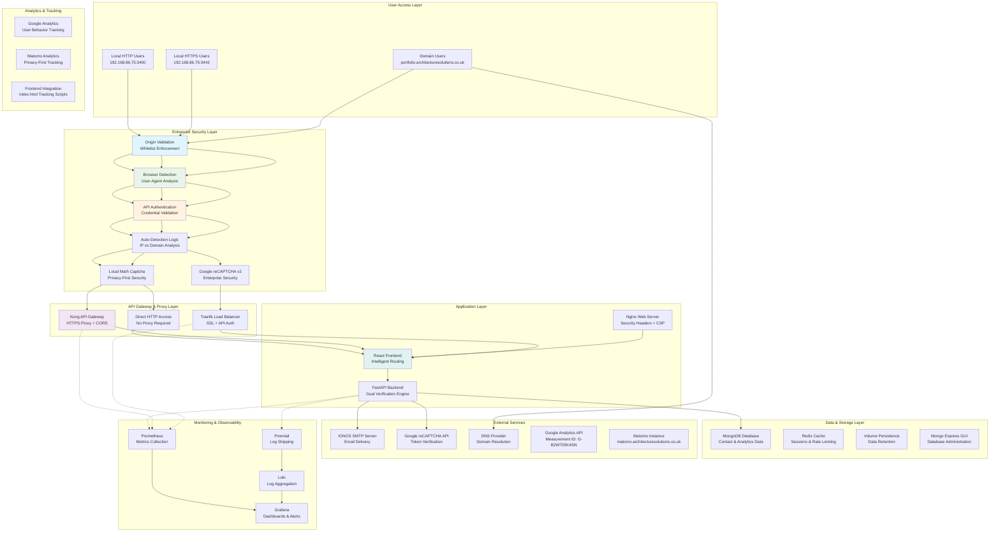
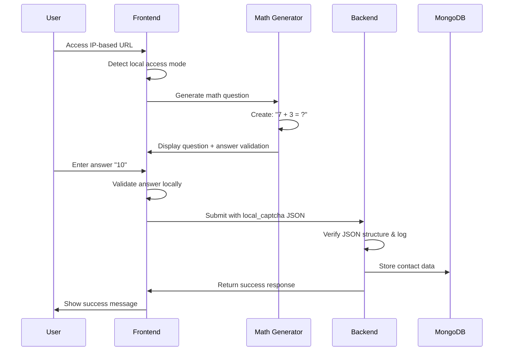
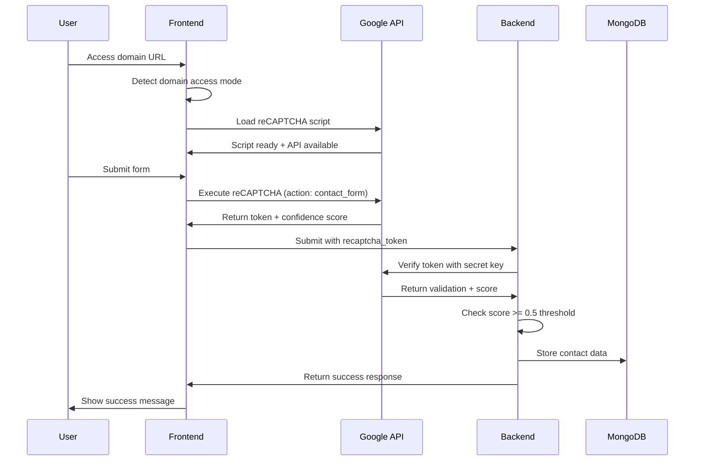
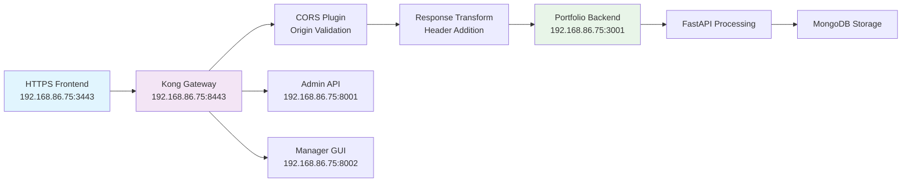
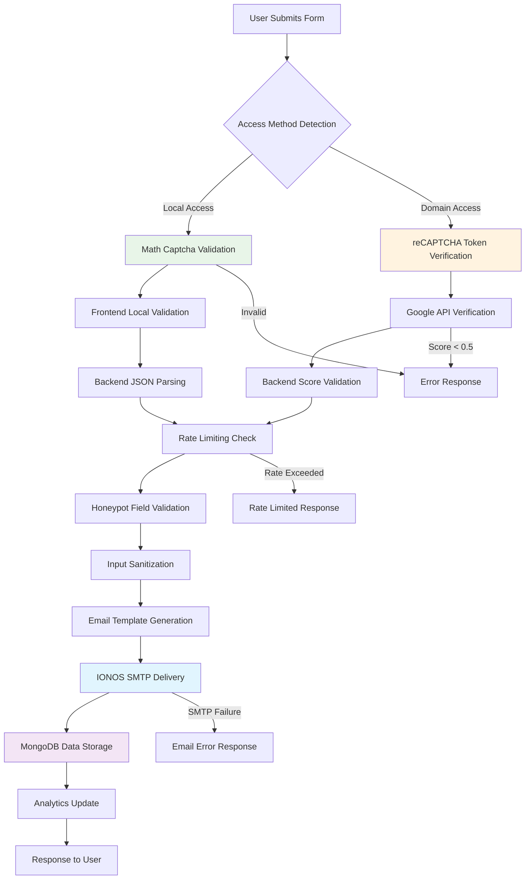
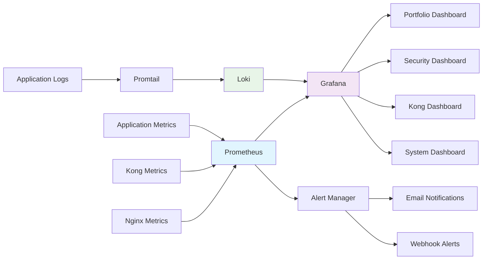

# System Architecture - Final Implementation

## 🏗️ **Production Architecture Overview**

This document describes the **final implemented architecture** featuring intelligent dual security, Kong API Gateway integration, and comprehensive monitoring for the Kamal Singh Portfolio Platform.

## 🌐 **High-Level System Architecture**



## 🔀 **Access Method Detection & Routing**

### **Frontend Intelligence Engine**
```javascript
// Core detection logic implemented in SimpleContact.jsx
const detectAccessMethod = () => {
  const hostname = window.location.hostname;
  const protocol = window.location.protocol;
  
  // IP Address Pattern Detection
  const isIPAddress = hostname.match(/^\d+\.\d+\.\d+\.\d+$/);
  const isLocalhost = hostname === 'localhost' || hostname === '127.0.0.1';
  
  if (isIPAddress || isLocalhost) {
    // Local Access Mode
    return {
      mode: 'local',
      captcha: 'math',
      routing: protocol === 'https:' ? 'kong' : 'direct',
      backend: protocol === 'https:' 
        ? `https://${KONG_HOST}:${KONG_PORT}` 
        : `http://${hostname}:3001`,
      authentication: false
    };
  }
  
  // Domain Access Mode  
  return {
    mode: 'domain',
    captcha: 'recaptcha',
    routing: 'traefik', 
    backend: `https://${hostname}`,
    authentication: true
  };
};
```

### **Routing Decision Matrix**
| Access URL | Detection | Captcha | Gateway | Backend Route | Authentication |
|------------|-----------|---------|---------|---------------|----------------|
| `http://192.168.86.75:3400` | IP + HTTP | Math | Direct | `http://192.168.86.75:3001` | None |
| `https://192.168.86.75:3443` | IP + HTTPS | Math | Kong | `https://192.168.86.75:8443` | None |
| `https://portfolio.architecturesolutions.co.uk` | Domain | reCAPTCHA | Traefik | `https://portfolio.architecturesolutions.co.uk` | API Key |

## 🛡️ **Dual Security Implementation**

### **Local Math Captcha System**


#### **Math Captcha Features**
- **Question Types**: Addition, Subtraction, Multiplication
- **Difficulty Range**: Numbers 1-10 for user-friendliness
- **Validation**: Both frontend and backend verification
- **Session Tracking**: Unique captcha IDs per submission
- **Refresh Capability**: New questions on demand

#### **Implementation Details**
```javascript
// Math captcha generation logic
const generateMathCaptcha = () => {
  const operations = ['+', '-', '×'];
  const num1 = Math.floor(Math.random() * 10) + 1;
  const num2 = Math.floor(Math.random() * 10) + 1;
  const operation = operations[Math.floor(Math.random() * operations.length)];
  
  let answer, question;
  switch(operation) {
    case '+':
      answer = num1 + num2;
      question = `${num1} + ${num2}`;
      break;
    case '-':
      const larger = Math.max(num1, num2);
      const smaller = Math.min(num1, num2);
      answer = larger - smaller;
      question = `${larger} - ${smaller}`;
      break;
    case '×':
      answer = num1 * num2;
      question = `${num1} × ${num2}`;
      break;
  }
  
  return { question, answer, id: Date.now() };
};
```

### **Google reCAPTCHA v3 System**


#### **reCAPTCHA Configuration**
- **Version**: reCAPTCHA v3 (invisible)
- **Site Key**: `6LcgftMrAAAAAPJRuWA4mQgstPWYoIXoPM4PBjMM`
- **Action**: `contact_form`
- **Score Threshold**: 0.5 (configurable)
- **Timeout**: 30 seconds for token generation

## 🌉 **Kong API Gateway Architecture**

### **Kong Service Configuration**
```yaml
# Production Kong Setup for Portfolio Application
services:
  - name: portfolio-backend
    url: http://192.168.86.75:3001
    protocol: http
    connect_timeout: 60000
    write_timeout: 60000
    read_timeout: 60000

routes:
  - name: portfolio-api-route
    service: portfolio-backend
    protocols: ["https"]
    hosts: ["192.168.86.75"]
    paths: ["/api"]
    methods: ["GET", "POST", "PUT", "DELETE", "OPTIONS"]
    strip_path: false
    preserve_host: false

plugins:
  # CORS Plugin for Local HTTPS Frontend
  - name: cors
    service: portfolio-backend
    config:
      origins: ["https://192.168.86.75:3443"]
      methods: ["GET", "POST", "PUT", "DELETE", "OPTIONS"]
      headers: ["Accept", "Content-Type", "Authorization", "X-Requested-With"]
      credentials: true
      
  # Response Transformation for Additional CORS
  - name: response-transformer
    service: portfolio-backend
    config:
      add:
        headers: ["Access-Control-Allow-Origin:*"]
```

### **Kong Request Flow**


## 🔒 **Traefik Load Balancer Architecture**

### **Production Domain Configuration**
```yaml
# Traefik Dynamic Configuration for Domain Access
http:
  routers:
    portfolio-frontend:
      rule: "Host(`portfolio.architecturesolutions.co.uk`)"
      service: frontend-service
      middlewares: ["secure-headers"]
      tls:
        certResolver: "letsencrypt"
        
    portfolio-api:
      rule: "Host(`portfolio.architecturesolutions.co.uk`) && PathPrefix(`/api`)"
      service: backend-service
      middlewares: ["api-auth", "secure-headers"]
      tls:
        certResolver: "letsencrypt"
        
  services:
    frontend-service:
      loadBalancer:
        servers:
          - url: "http://192.168.86.75:3000"
          
    backend-service:
      loadBalancer:
        servers:
          - url: "http://192.168.86.75:3001"
          
  middlewares:
    api-auth:
      headers:
        customRequestHeaders:
          X-API-Key: "${API_KEY}"
          
    secure-headers:
      headers:
        customRequestHeaders:
          X-Frame-Options: "DENY"
          X-Content-Type-Options: "nosniff"
```

## 🔧 **Environment Variable Architecture**

### **Build-Time Injection System**
```dockerfile
# Dockerfile.https.optimized - Environment Variable Injection
FROM node:18-alpine as build-stage

# Build arguments for all environment variables
ARG REACT_APP_BACKEND_URL=http://localhost:8001
ARG REACT_APP_KONG_HOST=192.168.86.75
ARG REACT_APP_KONG_PORT=8443
ARG REACT_APP_BACKEND_URL_HTTP=http://192.168.86.75:3001
ARG REACT_APP_RECAPTCHA_SITE_KEY=6LcgftMrAAAAAPJRuWA4mQgstPWYoIXoPM4PBjMM

# Environment variables for React build
ENV REACT_APP_BACKEND_URL=$REACT_APP_BACKEND_URL
ENV REACT_APP_KONG_HOST=$REACT_APP_KONG_HOST
ENV REACT_APP_KONG_PORT=$REACT_APP_KONG_PORT
ENV REACT_APP_BACKEND_URL_HTTP=$REACT_APP_BACKEND_URL_HTTP
ENV REACT_APP_RECAPTCHA_SITE_KEY=$REACT_APP_RECAPTCHA_SITE_KEY

# Build application with injected variables
RUN npm run build
```

### **Docker Compose Integration**
```yaml
# docker-compose.production.yml - Build Arguments
services:
  frontend-https:
    build:
      context: .
      dockerfile: Dockerfile.https.optimized
      args:
        REACT_APP_BACKEND_URL: ${REACT_APP_BACKEND_URL}
        REACT_APP_KONG_HOST: ${REACT_APP_KONG_HOST}
        REACT_APP_KONG_PORT: ${REACT_APP_KONG_PORT}
        REACT_APP_BACKEND_URL_HTTP: ${REACT_APP_BACKEND_URL_HTTP}
        REACT_APP_RECAPTCHA_SITE_KEY: ${REACT_APP_RECAPTCHA_SITE_KEY}
```

### **Deployment Script Variable Export**
```bash
# deploy-with-params.sh - Environment Variable Export
export REACT_APP_BACKEND_URL="https://portfolio.architecturesolutions.co.uk"
export REACT_APP_KONG_HOST="192.168.86.75"
export REACT_APP_KONG_PORT="8443"
export REACT_APP_BACKEND_URL_HTTP="http://192.168.86.75:3001"
export REACT_APP_RECAPTCHA_SITE_KEY="6LcgftMrAAAAAPJRuWA4mQgstPWYoIXoPM4PBjMM"
```

## 📊 **Data Flow Architecture**

### **Contact Form Processing Flow**


### **Monitoring Data Pipeline**


## 🔐 **Enhanced Multi-Layer Security Architecture**

### **Security Layer Breakdown**

1. **Origin Validation Layer (S1)**:
   - Validates request origin against whitelist
   - Prevents unauthorized domain access
   - Returns 403 Forbidden for invalid origins

2. **Browser Detection Layer (S2)**:
   - Analyzes User-Agent headers
   - Differentiates browser vs API requests
   - Enables appropriate authentication flow

3. **API Authentication Layer (S3)**:
   - Validates API credentials for non-browser requests
   - Requires X-API-Key and X-API-Secret headers
   - Returns 401 Unauthorized for invalid/missing credentials

4. **Access Method Detection (S4)**:
   - Determines IP vs Domain access method
   - Routes to appropriate CAPTCHA system
   - Maintains backward compatibility

5. **CAPTCHA Verification (S5/S6)**:
   - S5: Local math CAPTCHA for IP access
   - S6: Google reCAPTCHA v3 for domain access
   - Prevents automated abuse

### **Security Configuration**

```env
# API Authentication
API_KEY=portfolio-api-key-secure-2024
API_SECRET=portfolio-api-secret-secure-2024
API_AUTH_ENABLED=true

# CAPTCHA Configuration  
RECAPTCHA_SECRET_KEY=6LcgftMrAAAAANYLqKcqycaZrYzEhpVBmQNeacsm
RECAPTCHA_SITE_KEY=6LcgftMrAAAAaPJRuWA4mQgstPWYoIXoPM4PBjMM
```

## 🔒 **Security Architecture Layers**

### **Layer 1: Network Security**
- **HTTPS Enforcement**: TLS 1.3 encryption for all traffic
- **CORS Configuration**: Origin-based access control
- **CSP Headers**: Content Security Policy implementation
- **SSL Certificates**: Let's Encrypt or custom certificates

### **Layer 2: Application Security**
- **Dual Captcha**: Math captcha + reCAPTCHA v3
- **Rate Limiting**: 5 requests/minute per IP address
- **Input Validation**: Pydantic models with field validation
- **Honeypot Fields**: Hidden form fields for bot detection

### **Layer 3: API Security**
- **Authentication Bypass**: IP-based access patterns
- **API Key Authentication**: Domain-based access control
- **Request Signing**: Header validation for API calls
- **Token Validation**: JWT or API key verification

### **Layer 4: Infrastructure Security**
- **Container Isolation**: Docker security boundaries
- **User Permissions**: Non-root container execution
- **Network Segmentation**: Container network isolation
- **Volume Security**: Persistent data protection

### **Layer 5: Monitoring Security**
- **Access Logging**: Comprehensive request logging
- **Security Events**: Failed authentication tracking
- **Anomaly Detection**: Unusual traffic pattern alerts
- **Incident Response**: Automated security notifications

## 📈 **Performance Architecture**

### **Frontend Optimization**
- **Build Optimization**: Webpack bundle optimization
- **Code Splitting**: Lazy loading for routes
- **Asset Caching**: Nginx static file caching
- **CDN Integration**: Static asset delivery optimization

### **Backend Optimization**
- **Async Operations**: FastAPI async request handling
- **Connection Pooling**: Database connection optimization
- **Caching Strategy**: Redis integration capability
- **Query Optimization**: MongoDB indexing and aggregation

### **Network Optimization**
- **Kong Proxy**: < 50ms additional latency
- **Traefik Routing**: Efficient load balancing
- **Nginx Compression**: Gzip compression for responses
- **Keep-Alive**: HTTP connection reuse

### **Database Optimization**
- **Indexing Strategy**: Optimized query performance
- **Connection Management**: Pool size optimization
- **Data Modeling**: Efficient document structure
- **Backup Strategy**: Automated backup procedures

## 🔄 **Deployment Architecture**

### **Container Orchestration**
```yaml
# Production Docker Compose Services
services:
  frontend-http:     # React HTTP frontend
  frontend-https:    # React HTTPS frontend  
  backend:           # FastAPI application
  mongodb:           # Database service
  redis:             # Cache & session store
  mongo-express:     # Database GUI
  prometheus:        # Metrics collection
  grafana:          # Monitoring dashboards
  loki:             # Log aggregation
  promtail:         # Log shipping
```

### **Technology Stack**

#### **Frontend Layer**
- **Framework**: React 18+ with functional components
- **Routing**: React Router v6
- **Styling**: Tailwind CSS + Custom CSS
- **Analytics Integration**: 
  - Google Analytics (gtag.js) - Measurement ID: G-B2W705K4SN
  - Matomo Analytics - Container: Bx60SjUR
  - **Integration Method**: Direct script injection in `/public/index.html`
- **Build Tool**: Create React App
- **HTTP Server**: Nginx with security headers

#### **Backend Layer** 
- **Framework**: FastAPI (Python 3.9+)
- **Authentication**: JWT + API Key validation
- **Rate Limiting**: SlowAPI middleware
- **Email Service**: IONOS SMTP integration
- **CORS**: Configurable origin whitelist

#### **Data Layer**
- **Primary Database**: MongoDB 6.0+ (Document storage)
- **Cache Layer**: Redis 7-alpine 
  - **Usage**: Session storage, rate limiting counters, API response caching
  - **Configuration**: Password protected, persistent storage, memory optimization
- **Persistence**: Docker volumes for data retention

#### **Security & Analytics**
- **Captcha Systems**: 
  - Local Math Captcha (privacy-first)
  - Google reCAPTCHA v3 (enterprise security)
- **API Security**: Origin validation + credential verification  
- **Analytics**: Dual tracking with Google Analytics + Matomo
- **SSL/TLS**: Self-signed certificates for local HTTPS

### **Volume Management**
- **MongoDB Data**: Persistent volume for database
- **SSL Certificates**: Volume for TLS certificates
- **Log Storage**: Persistent logging data
- **Backup Storage**: Automated backup volumes

### **Health Monitoring**
- **Container Health**: Docker health checks
- **Service Health**: Application health endpoints
- **Database Health**: MongoDB connection monitoring
- **External Service Health**: SMTP and API monitoring

This architecture provides a robust, scalable, and secure foundation for the portfolio application with intelligent adaptation to different access methods and deployment scenarios.