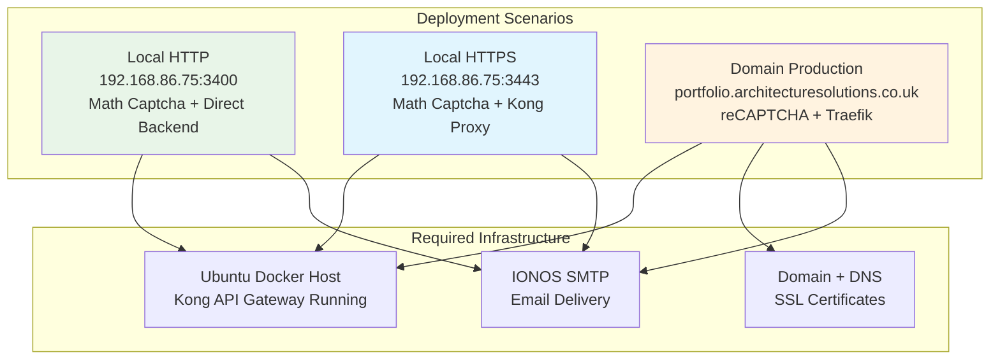

# 🚀 Complete Deployment Guide - Final Implementation

## 📋 **Overview**

This guide covers deploying the **final production-ready architecture** with intelligent dual captcha security, Kong API Gateway integration, and comprehensive monitoring.

## 🏗️ **Architecture Summary**



## 📋 **Prerequisites**

### **System Requirements**
- **OS**: Ubuntu 20.04+ or compatible Linux distribution
- **Docker**: Version 20.10+
- **Docker Compose**: Version 2.0+
- **Memory**: Minimum 4GB RAM (8GB recommended)
- **Storage**: 20GB available disk space
- **Network**: Required ports available (see port configuration below)

### **Required Services**
- **Kong API Gateway**: Must be installed and running for HTTPS local access
- **SMTP Server**: IONOS SMTP recommended (smtp.ionos.co.uk:465)
- **Domain**: Required for production deployment (optional for local)
- **SSL Certificates**: Let's Encrypt or custom certificates

### **Port Configuration**
```bash
# Default Ports (configurable during deployment)
HTTP Frontend:      3400
HTTPS Frontend:     3443  
Backend API:        3001
MongoDB:            27017
Mongo Express:      8081
Prometheus:         9090
Grafana:            3000
Loki:               3100

# Kong Ports (must be available)
Kong HTTP Proxy:    8000
Kong HTTPS Proxy:   8443
Kong Admin API:     8001
Kong Manager GUI:   8002 (optional)
```

## 🚀 **Deployment Methods**

### **Method 1: Local Development (HTTP Only)**

#### **Basic Local Setup**
```bash
# Clone repository
git clone <repository-url>
cd portfolio-app

# Deploy with minimal configuration
./scripts/deploy-with-params.sh \
  --http-port 3400 \
  --backend-port 3001

# Access
# Frontend: http://localhost:3400 (Math Captcha)
# Backend:  http://localhost:3001
```

#### **Expected Results**
- ✅ HTTP frontend with local math captcha
- ✅ Direct backend API calls (no proxy)
- ✅ Contact form with IONOS email delivery
- ✅ MongoDB data persistence

---

### **Method 2: Local HTTPS with Kong Integration**

#### **Kong-Enabled Local Deployment**
```bash
# Prerequisite: Ensure Kong is running
curl -f http://192.168.86.75:8001/status || echo "Kong not running"

# Deploy with Kong integration
./scripts/deploy-with-params.sh \
  --http-port 3400 \
  --https-port 3443 \
  --kong-host 192.168.86.75 \
  --kong-port 8443 \
  --smtp-server smtp.ionos.co.uk \
  --smtp-port 465 \
  --smtp-use-ssl true \
  --smtp-username your.email@domain.com \
  --smtp-password "YourSMTPPassword"
```

#### **Kong Configuration Commands**
```bash
# Configure Kong service for portfolio backend
curl -X POST http://192.168.86.75:8001/services/ \
  --data "name=portfolio-backend" \
  --data "url=http://192.168.86.75:3001"

# Configure Kong route for API paths
curl -X POST http://192.168.86.75:8001/services/portfolio-backend/routes \
  --data "name=portfolio-api-route" \
  --data "paths[]=/api" \
  --data "methods[]=GET" \
  --data "methods[]=POST" \
  --data "methods[]=OPTIONS"

# Configure CORS plugin for HTTPS frontend
curl -X POST http://192.168.86.75:8001/services/portfolio-backend/plugins \
  --data "name=cors" \
  --data "config.origins=https://192.168.86.75:3443" \
  --data "config.methods[]=GET" \
  --data "config.methods[]=POST" \
  --data "config.methods[]=OPTIONS" \
  --data "config.headers=Accept,Content-Type,Authorization,X-Requested-With" \
  --data "config.credentials=true"
```

#### **Expected Access URLs**
```bash
# HTTP Frontend (Direct Backend)
HTTP Frontend:  http://192.168.86.75:3400
Backend Route:  http://192.168.86.75:3001/api/*

# HTTPS Frontend (Kong Proxy)  
HTTPS Frontend: https://192.168.86.75:3443
Backend Route:  https://192.168.86.75:8443/api/* (via Kong)

# Management Interfaces
Kong Admin:     http://192.168.86.75:8001
Kong Manager:   http://192.168.86.75:8002 (if available)
MongoDB GUI:    http://192.168.86.75:8081
Grafana:        http://192.168.86.75:3000
```

---

### **Method 3: Production Domain Deployment**

#### **Domain DNS Configuration**
```bash
# Configure DNS A/AAAA records
portfolio.architecturesolutions.co.uk → YOUR_SERVER_IP

# Verify DNS propagation
nslookup portfolio.architecturesolutions.co.uk
dig portfolio.architecturesolutions.co.uk
```

#### **SSL Certificate Setup**
```bash
# Option A: Let's Encrypt (Automated via Traefik)
# Automatically handled during deployment

# Option B: Custom Certificates
mkdir -p ./ssl
# Place your certificates in ./ssl/ directory
# - portfolio.architecturesolutions.co.uk.crt
# - portfolio.architecturesolutions.co.uk.key
```

#### **Full Production Deployment**
```bash
# Deploy with domain and complete security stack
./scripts/deploy-with-params.sh \
  --domain portfolio \
  --recaptcha-site-key "6LcgftMrAAAAAPJRuWA4mQgstPWYoIXoPM4PBjMM" \
  --recaptcha-secret-key "6LcgftMrAAAAANYLqKcqycaZrYzEhpVBmQNeacsm" \
  --smtp-server smtp.ionos.co.uk \
  --smtp-port 465 \
  --smtp-use-ssl true \
  --smtp-username kamal.singh@architecturesolutions.co.uk \
  --smtp-password "SecurePassword123" \
  --api-key "secure-api-key-for-production" \
  --mongo-password "SecureMongoPassword" \
  --grafana-password "SecureGrafanaPassword" \
  --environment production
```

#### **Traefik Configuration** 
```yaml
# Automatically generated traefik configuration
http:
  routers:
    portfolio-frontend:
      rule: "Host(`portfolio.architecturesolutions.co.uk`)"
      service: frontend-service
      tls:
        certResolver: "letsencrypt"
        
    portfolio-api:
      rule: "Host(`portfolio.architecturesolutions.co.uk`) && PathPrefix(`/api`)"
      service: backend-service
      middlewares: ["api-auth"]
      
  middlewares:
    api-auth:
      headers:
        customRequestHeaders:
          X-API-Key: "secure-api-key-for-production"
```

#### **Expected Production Access**
```bash
# Domain Access (reCAPTCHA + Traefik)
Frontend: https://portfolio.architecturesolutions.co.uk
API:      https://portfolio.architecturesolutions.co.uk/api/*

# Management (IP-based)
Grafana:  http://192.168.86.75:3000
MongoDB:  http://192.168.86.75:8081
```

---

### **Method 4: Hybrid Deployment (All Access Methods)**

#### **Multi-Access Configuration**
```bash
# Deploy supporting all access methods simultaneously
./scripts/deploy-with-params.sh \
  --domain portfolio \
  --http-port 3400 \
  --https-port 3443 \
  --kong-host 192.168.86.75 \
  --kong-port 8443 \
  --recaptcha-site-key "6LcgftMrAAAAAPJRuWA4mQgstPWYoIXoPM4PBjMM" \
  --recaptcha-secret-key "6LcgftMrAAAAANYLqKcqycaZrYzEhpVBmQNeacsm" \
  --smtp-server smtp.ionos.co.uk \
  --smtp-port 465 \
  --smtp-use-ssl true \
  --smtp-username kamal.singh@architecturesolutions.co.uk \
  --smtp-password "SecurePassword" \
  --api-key "production-api-key"
```

#### **Multi-Access Results**
```bash
# All access methods available
Local HTTP:   http://192.168.86.75:3400   (Math + Direct)
Local HTTPS:  https://192.168.86.75:3443  (Math + Kong)
Domain:       https://portfolio.architecturesolutions.co.uk (reCAPTCHA + Traefik)

# Each with appropriate security:
# - Local access: No API authentication, math captcha
# - Domain access: API authentication required, Google reCAPTCHA
```

## 🔧 **Configuration Parameters Reference**

### **Network & Port Configuration**
```bash
--http-port 3400              # Frontend HTTP port
--https-port 3443             # Frontend HTTPS port
--backend-port 3001           # Backend API port
--mongo-port 27017            # MongoDB database port
--prometheus-port 9090        # Prometheus metrics port
--grafana-port 3000           # Grafana dashboard port
--loki-port 3100             # Loki log aggregation port
--mongo-express-port 8081     # MongoDB web interface port
```

### **Kong API Gateway Configuration**
```bash
--kong-host 192.168.86.75     # Kong gateway host IP
--kong-port 8443              # Kong HTTPS proxy port
--kong-admin-port 8001        # Kong admin API port (typically fixed)
```

### **Domain & SSL Configuration**
```bash
--domain portfolio            # Subdomain (becomes portfolio.architecturesolutions.co.uk)
--ssl-cert-path /path/certs   # Custom SSL certificate directory
--ssl-auto-generate true      # Enable Let's Encrypt certificates
```

### **Security Configuration**
```bash
--recaptcha-site-key KEY      # Google reCAPTCHA v3 site key
--recaptcha-secret-key KEY    # Google reCAPTCHA v3 secret key
--api-key KEY                 # Backend API authentication key (domain access)
--secret-key KEY              # Application secret key
```

### **Email Configuration**
```bash
--smtp-server smtp.ionos.co.uk    # SMTP server hostname
--smtp-port 465                   # SMTP port (465=SSL, 587=TLS)
--smtp-use-ssl true               # Enable SSL encryption
--smtp-username email@domain.com  # SMTP authentication username
--smtp-password password          # SMTP authentication password
--from-email sender@domain.com    # Default sender email address
--to-email recipient@domain.com   # Default recipient email address
```

### **Database Configuration**
```bash
--mongo-username admin        # MongoDB admin username
--mongo-password password     # MongoDB admin password
--db-name portfolio_db        # Database name
```

### **Monitoring Configuration**
```bash
--grafana-password admin      # Grafana admin password
--prometheus-retention 15d    # Metrics retention period
--log-level info             # Application log level
```

## 🔍 **Post-Deployment Verification**

### **Health Check Commands**
```bash
# Backend API Health
curl -f http://192.168.86.75:3001/api/health

# Frontend Accessibility
curl -I http://192.168.86.75:3400
curl -k -I https://192.168.86.75:3443

# Database Connectivity
curl -f http://192.168.86.75:8081

# Monitoring Stack
curl -f http://192.168.86.75:9090/-/healthy    # Prometheus
curl -f http://192.168.86.75:3000/api/health   # Grafana

# Kong Status (if deployed)
curl -f http://192.168.86.75:8001/status
```

### **Environment Variable Verification**
```bash
# Run the debug script to verify configuration
./scripts/debug-frontend-env.sh

# Expected output:
# ✅ Frontend .env file exists
# ✅ Container environment variables found
# ✅ CSP header allows Kong connections
# ✅ Kong URL found in JavaScript build
```

### **Captcha System Verification**
```bash
# Test local math captcha (IP access)
curl -X POST http://192.168.86.75:3001/api/contact/send-email \
  -H "Content-Type: application/json" \
  -d '{
    "name": "Test User",
    "email": "test@example.com",
    "message": "Testing local math captcha",
    "local_captcha": "{\"type\":\"local_captcha\",\"captcha_id\":\"test_123\",\"user_answer\":\"42\"}"
  }'

# Test Google reCAPTCHA (domain access)
curl -X POST https://portfolio.architecturesolutions.co.uk/api/contact/send-email \
  -H "Content-Type: application/json" \
  -H "X-API-Key: your-api-key-here" \
  -d '{
    "name": "Test User",
    "email": "test@example.com",
    "message": "Testing Google reCAPTCHA",
    "recaptcha_token": "VALID_RECAPTCHA_TOKEN_HERE"
  }'
```

### **Kong Gateway Verification**
```bash
# Kong service status
curl -X GET http://192.168.86.75:8001/services

# Kong route configuration  
curl -X GET http://192.168.86.75:8001/routes

# Kong plugin configuration
curl -X GET http://192.168.86.75:8001/plugins

# Test Kong proxy
curl -k -X GET https://192.168.86.75:8443/api/health
```

## 🔧 **Troubleshooting Guide**

### **Common Issues & Solutions**

#### **Issue 1: Environment Variables Not Injected**
```bash
# Symptoms: Kong routing not working, variables missing in container
# Debug: ./scripts/debug-frontend-env.sh shows missing variables

# Solution: Verify deployment script exports
grep -n "export.*REACT_APP" ./scripts/deploy-with-params.sh
# Should show exports for KONG_HOST, KONG_PORT, etc.

# Rebuild containers if needed
docker-compose down
docker-compose up -d --build --no-cache
```

#### **Issue 2: Kong Connection Refused**
```bash
# Symptoms: HTTPS frontend shows CORS errors, Kong unreachable
# Debug commands:
curl -f http://192.168.86.75:8001/status    # Check Kong admin
docker ps | grep kong                        # Check Kong containers
netstat -tlnp | grep 8443                   # Check Kong proxy port

# Solutions:
# 1. Restart Kong service
sudo systemctl restart kong
# 2. Verify Kong configuration
curl -X GET http://192.168.86.75:8001/services
# 3. Reconfigure Kong service and routes (see Method 2 above)
```

#### **Issue 3: reCAPTCHA Invalid Domain**
```bash
# Symptoms: Domain access shows "Invalid domain for site key"
# Solution: Update Google reCAPTCHA console
# 1. Go to https://www.google.com/recaptcha/admin
# 2. Add your domain: portfolio.architecturesolutions.co.uk
# 3. Verify site key in deployment: --recaptcha-site-key "6LcgftMr..."
```

#### **Issue 4: SMTP Authentication Failed**
```bash
# Symptoms: Email sending fails with authentication errors
# Debug: Check backend logs
tail -n 50 /var/log/supervisor/backend.err.log

# Solution: Verify SMTP configuration
--smtp-server smtp.ionos.co.uk
--smtp-port 465
--smtp-use-ssl true
--smtp-username correct.email@domain.com
--smtp-password "correct-password"

# Test SMTP connectivity
telnet smtp.ionos.co.uk 465
```

#### **Issue 5: Frontend Showing "Something went wrong"**
```bash
# Symptoms: React error boundary triggered, app crashes
# Debug: Check browser console for JavaScript errors
# Common causes:
# 1. Environment variables not loaded
# 2. Build-time vs runtime variable conflicts
# 3. Missing dependencies

# Solution: Check debug script output and rebuild
./scripts/debug-frontend-env.sh
docker-compose up -d --build frontend-https
```

## 📊 **Monitoring & Maintenance**

### **Dashboard Access**
```bash
# Grafana Dashboards
URL: http://192.168.86.75:3000
Username: admin
Password: [configured during deployment]

Available Dashboards:
- Portfolio Overview: Application health and performance
- Contact Analytics: Form submission metrics
- Security Metrics: Captcha performance and bot detection  
- Kong Gateway: Proxy performance and routing statistics
- System Health: Resource utilization and alerts
```

### **Log Analysis**
```bash
# Application logs
docker logs portfolio-frontend-https
docker logs portfolio-backend

# Supervisor logs
tail -f /var/log/supervisor/backend.*.log
tail -f /var/log/supervisor/frontend.*.log

# Kong logs (if Kong is containerized)
docker logs kong-gateway
```

### **Performance Monitoring**
```bash
# Prometheus metrics
curl http://192.168.86.75:9090/api/v1/query?query=up

# Key metrics to monitor:
# - http_requests_total{status="200"}
# - contact_form_submissions_total
# - captcha_verifications_total{type="local_math"}
# - captcha_verifications_total{type="google_recaptcha"}
# - kong_bandwidth
```

### **Backup & Maintenance**
```bash
# Database backup
./scripts/backup.sh --include-database

# Full system backup  
./scripts/backup.sh --include-database --include-configs

# Update deployment
./scripts/deploy-with-params.sh [same parameters as original deployment]

# Restart services if needed
sudo supervisorctl restart all
```

## 🎯 **Deployment Scenarios Summary**

| Scenario | Access URL | Captcha | Gateway | Use Case |
|----------|------------|---------|---------|----------|
| **Local HTTP** | `http://192.168.86.75:3400` | Math | Direct | Development |
| **Local HTTPS** | `https://192.168.86.75:3443` | Math | Kong | Local Production |
| **Domain** | `https://portfolio.architecturesolutions.co.uk` | reCAPTCHA | Traefik | Public Production |
| **Hybrid** | All above URLs | Both | All | Testing/Migration |

This deployment guide ensures reliable, secure, and scalable deployment across all supported scenarios with comprehensive verification and troubleshooting procedures.