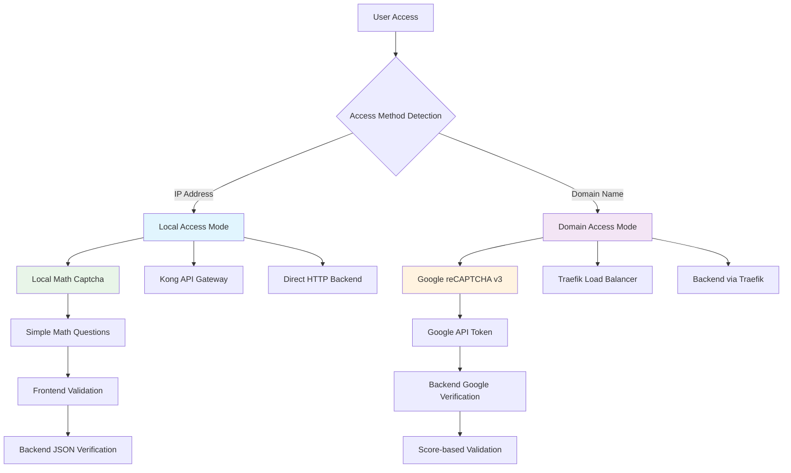

# Dual Captcha Architecture - Local vs Domain-based Security

## 🛡️ **Security by Access Method**

This application implements a sophisticated **dual captcha system** that automatically selects the appropriate security verification based on how users access the application.

## 📋 **Architecture Overview**



## 🏠 **Local Access Mode (IP-based)**

### **Detection Logic:**
```javascript
// Frontend automatically detects IP addresses
const isLocalAccess = () => {
  const hostname = window.location.hostname;
  return hostname.match(/^\d+\.\d+\.\d+\.\d+$/) || 
         hostname === 'localhost' || 
         hostname === '127.0.0.1';
};
```

### **Access URLs:**
- **HTTP**: `http://192.168.86.75:3400`
- **HTTPS**: `https://192.168.86.75:3443` 

### **Security Components:**

#### **Local Math Captcha:**
- **Type**: Simple arithmetic questions (e.g., "What is 7 + 3?")
- **Implementation**: React component with refresh functionality
- **Validation**: Frontend + Backend JSON verification
- **No External Dependencies**: No Google services required

#### **API Routing:**
- **HTTP Frontend** → **Direct Backend**: `http://192.168.86.75:3001`
- **HTTPS Frontend** → **Kong Proxy**: `https://192.168.86.75:8443` → Backend

#### **Benefits:**
- ✅ **Offline Capability**: No internet required for captcha
- ✅ **Privacy Focused**: No third-party data collection
- ✅ **Fast Response**: Instant validation
- ✅ **Kong Integration**: HTTPS mixed content resolved

---

## 🌐 **Domain Access Mode (Production)**

### **Detection Logic:**
```javascript  
// Frontend detects proper domain names
const isDomainAccess = () => {
  const hostname = window.location.hostname;
  return !hostname.match(/^\d+\.\d+\.\d+\.\d+$/) && 
         hostname !== 'localhost';
};
```

### **Access URLs:**
- **Production**: `https://portfolio.architecturesolutions.co.uk`
- **Preview**: `https://gateway-security.preview.emergentagent.com`

### **Security Components:**

#### **Google reCAPTCHA v3:**
- **Type**: Invisible background verification
- **Site Key**: `6LcgftMrAAAAAPJRuWA4mQgstPWYoIXoPM4PBjMM`
- **Validation**: Google's AI-powered risk analysis
- **Score-based**: 0.0 (bot) to 1.0 (human)

#### **API Routing:**
- **Domain Frontend** → **Traefik Load Balancer** → **Backend**
- **API Authentication**: Required for domain access
- **SSL Termination**: Handled by Traefik

#### **Benefits:**
- 🛡️ **Advanced Security**: Google's ML-powered bot detection
- 🌍 **Global Protection**: Cloud-based threat intelligence
- 📊 **Analytics**: Detailed security metrics
- 🔒 **Production Ready**: Enterprise-grade security

---

## 🔧 **Implementation Details**

### **Frontend Component Logic:**
```jsx
// Auto-detection and captcha selection
const useLocalCaptcha = isLocalAccess();

{useLocalCaptcha ? (
  <LocalCaptcha
    onCaptchaChange={setLocalCaptchaData}
    isValid={localCaptchaValid}
    setIsValid={setLocalCaptchaValid}
  />
) : (
  <div className="bg-blue-50 p-3 rounded-lg">
    🛡️ Protected by Google reCAPTCHA
  </div>
)}
```

### **Backend Verification:**
```python
# Dual verification system
if contact_data.recaptcha_token:
    # Google reCAPTCHA for domain access
    is_valid, score = await verify_recaptcha(contact_data.recaptcha_token, client_ip)
elif contact_data.local_captcha:
    # Local captcha for IP access
    is_valid, error_msg = verify_local_captcha(contact_data.local_captcha, client_ip)
```

### **Environment Variables:**
```bash
# Local deployment
REACT_APP_KONG_HOST=192.168.86.75
REACT_APP_KONG_PORT=8443
REACT_APP_BACKEND_URL_HTTP=http://192.168.86.75:3001

# Domain deployment
REACT_APP_BACKEND_URL=https://portfolio.architecturesolutions.co.uk
REACT_APP_RECAPTCHA_SITE_KEY=6LcgftMrAAAAAPJRuWA4mQgstPWYoIXoPM4PBjMM
RECAPTCHA_SECRET_KEY=6LcgftMrAAAAANYLqKcqycaZrYzEhpVBmQNeacsm
```

## 🚀 **Deployment Scenarios**

### **Local Development/Testing:**
```bash
./scripts/deploy-with-params.sh \
  --http-port 3400 \
  --https-port 3443 \
  --kong-host 192.168.86.75 \
  --kong-port 8443
```
- **Result**: Local math captcha + Kong routing

### **Production Deployment:**
```bash
./scripts/deploy-with-params.sh \
  --domain portfolio.architecturesolutions.co.uk \
  --recaptcha-site-key "6LcgftMrAAAAA..." \
  --recaptcha-secret-key "6LcgftMrAAAAN..."
```
- **Result**: Google reCAPTCHA + Traefik routing

## 🔒 **Security Comparison**

| Feature | Local Captcha | Google reCAPTCHA |
|---------|---------------|------------------|
| **Bot Protection** | ⭐⭐⭐ Basic | ⭐⭐⭐⭐⭐ Advanced |
| **Privacy** | ⭐⭐⭐⭐⭐ Complete | ⭐⭐⭐ Moderate |
| **Offline Support** | ⭐⭐⭐⭐⭐ Yes | ❌ No |
| **Setup Complexity** | ⭐⭐⭐⭐⭐ Simple | ⭐⭐⭐ Moderate |
| **Performance** | ⭐⭐⭐⭐⭐ Instant | ⭐⭐⭐⭐ Fast |
| **Scalability** | ⭐⭐⭐ Limited | ⭐⭐⭐⭐⭐ Unlimited |

## 📝 **Usage Recommendations**

### **Use Local Captcha When:**
- 🏠 Internal company networks
- 🔒 High privacy requirements
- 📱 Offline deployments
- 🚀 Development/testing environments
- 💰 Cost-sensitive projects

### **Use Google reCAPTCHA When:**
- 🌐 Public internet access
- 🛡️ High security requirements  
- 📊 Analytics needed
- 🏢 Enterprise deployments
- 🚀 Production environments

## 🔄 **Future Enhancements**

### **Potential Improvements:**
1. **Adaptive Security**: Dynamic captcha difficulty based on risk
2. **Custom Math Operations**: More complex local questions
3. **Biometric Integration**: Fingerprint/face recognition for local access
4. **Machine Learning**: Local bot detection algorithms
5. **Hybrid Mode**: Combine both captcha types for maximum security

---

*This dual captcha architecture provides the perfect balance of security, privacy, and usability across different deployment scenarios.*