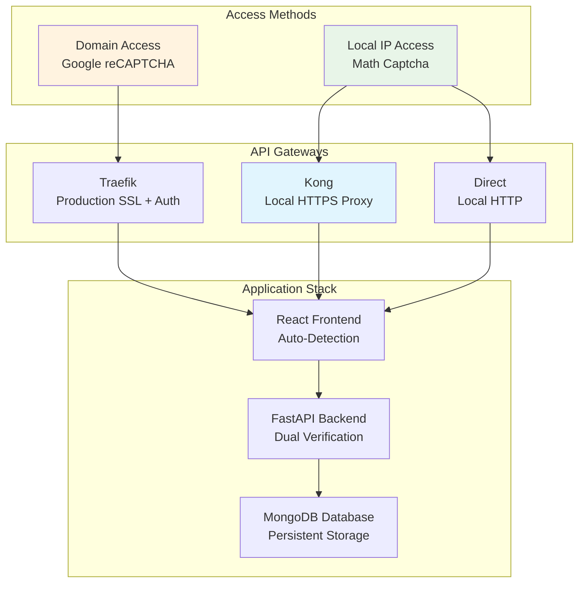

# Complete Deployment Guide - Dual Captcha Portfolio Platform

## 🎯 **Deployment Overview**

This guide covers deploying the portfolio application with **dual captcha security**, **Kong API Gateway**, and **comprehensive monitoring** across different environments.

## 🏗️ **Architecture Summary**



## 📋 **Prerequisites**

### **System Requirements**
- **OS**: Ubuntu 20.04+ or compatible Linux distribution
- **Docker**: Version 20.10+
- **Docker Compose**: Version 2.0+
- **Memory**: Minimum 4GB RAM (8GB recommended)
- **Storage**: 20GB available disk space
- **Network**: Ports 3000, 3001, 3400, 3443, 8443, 27017, 9090 available

### **Required Services**
- **Kong API Gateway**: For HTTPS local access
- **SMTP Server**: For email delivery (IONOS recommended)
- **Domain**: For production deployment (optional for local)
- **SSL Certificates**: For HTTPS (Let's Encrypt or custom)

## 🚀 **Deployment Methods**

## **Method 1: Local Development Deployment**

### **Step 1: Clone and Setup**
```bash
# Clone repository
git clone <repository-url>
cd portfolio-app

# Verify directory structure
ls -la scripts/

# Make deployment script executable
chmod +x scripts/deploy-with-params.sh
```

### **Step 2: Basic Local Deployment**
```bash
# Deploy with default local settings
./scripts/deploy-with-params.sh \
  --http-port 3400 \
  --https-port 3443 \
  --backend-port 3001 \
  --mongo-port 27017

# Expected Output:
# ✅ Frontend HTTP: http://localhost:3400 (Math Captcha)
# ✅ Frontend HTTPS: https://localhost:3443 (Math Captcha + Kong)
# ✅ Backend API: http://localhost:3001
# ✅ MongoDB: mongodb://localhost:27017
```

### **Step 3: Kong-Enabled Local Deployment**
```bash
# Deploy with Kong API Gateway integration
./scripts/deploy-with-params.sh \
  --http-port 3400 \
  --https-port 3443 \
  --kong-host 192.168.86.75 \
  --kong-port 8443 \
  --smtp-server smtp.ionos.co.uk \
  --smtp-port 465 \
  --smtp-use-ssl true \
  --smtp-username your.email@domain.com \
  --smtp-password "YourSMTPPassword"

# Expected Access URLs:
# HTTP Frontend: http://192.168.86.75:3400 → Direct Backend
# HTTPS Frontend: https://192.168.86.75:3443 → Kong → Backend  
# Kong Admin: http://192.168.86.75:8001
# Kong Proxy: https://192.168.86.75:8443
```

---

## **Method 2: Production Domain Deployment**

### **Step 1: Domain Configuration** 
```bash
# Configure DNS records (A/AAAA/CNAME)
portfolio.architecturesolutions.co.uk → YOUR_SERVER_IP

# Verify DNS propagation
nslookup portfolio.architecturesolutions.co.uk
```

### **Step 2: SSL Certificate Setup**
```bash
# Option A: Let's Encrypt (Automated)
./scripts/deploy-with-params.sh \
  --domain portfolio.architecturesolutions.co.uk \
  --ssl-auto-generate true

# Option B: Custom Certificates
./scripts/deploy-with-params.sh \
  --domain portfolio.architecturesolutions.co.uk \
  --ssl-cert-path /path/to/certificates/
```

### **Step 3: Full Production Deployment**
```bash
# Complete production deployment with all features
./scripts/deploy-with-params.sh \
  --domain portfolio.architecturesolutions.co.uk \
  --recaptcha-site-key "6LcgftMrAAAAAPJRuWA4mQgstPWYoIXoPM4PBjMM" \
  --recaptcha-secret-key "6LcgftMrAAAAANYLqKcqycaZrYzEhpVBmQNeacsm" \
  --smtp-server smtp.ionos.co.uk \
  --smtp-port 465 \
  --smtp-use-ssl true \
  --smtp-username kamal.singh@architecturesolutions.co.uk \
  --smtp-password "SecurePassword123" \
  --api-key "secure-api-key-for-production" \
  --mongo-password "SecureMongoPassword" \
  --grafana-password "SecureGrafanaPassword" \
  --environment production

# Expected Result:
# ✅ Domain Access: https://portfolio.architecturesolutions.co.uk (Google reCAPTCHA)
# ✅ Traefik Dashboard: https://traefik.architecturesolutions.co.uk
# ✅ Monitoring: https://monitoring.architecturesolutions.co.uk
```

---

## **Method 3: Hybrid Deployment (Local + Domain)**

### **Step 1: Multi-Access Deployment**
```bash
# Deploy supporting both local and domain access
./scripts/deploy-with-params.sh \
  --domain portfolio.architecturesolutions.co.uk \
  --http-port 3400 \
  --https-port 3443 \
  --kong-host 192.168.86.75 \
  --kong-port 8443 \
  --recaptcha-site-key "6LcgftMrAAAAAPJRuWA4mQgstPWYoIXoPM4PBjMM" \
  --recaptcha-secret-key "6LcgftMrAAAAANYLqKcqycaZrYzEhpVBmQNeacsm" \
  --smtp-server smtp.ionos.co.uk \
  --smtp-port 465 \
  --smtp-use-ssl true

# Results in multiple access methods:
# Domain: https://portfolio.architecturesolutions.co.uk (reCAPTCHA + Traefik)
# Local HTTP: http://192.168.86.75:3400 (Math Captcha + Direct)
# Local HTTPS: https://192.168.86.75:3443 (Math Captcha + Kong)
```

## 🔧 **Configuration Parameters**

### **Network & Ports**
```bash
--http-port 3400              # Frontend HTTP port
--https-port 3443             # Frontend HTTPS port  
--backend-port 3001           # Backend API port
--mongo-port 27017            # MongoDB port
--prometheus-port 9090        # Prometheus metrics
--grafana-port 3000           # Grafana dashboards
```

### **Kong API Gateway**
```bash
--kong-host 192.168.86.75     # Kong gateway IP address
--kong-port 8443              # Kong HTTPS proxy port
--kong-admin-port 8001        # Kong admin API port
```

### **Domain & SSL**
```bash
--domain example.com          # Primary domain name
--subdomain portfolio         # Subdomain prefix
--ssl-cert-path /path/certs   # Custom SSL certificate path
--ssl-auto-generate true      # Auto-generate Let's Encrypt certs
```

### **Security Configuration**
```bash
--recaptcha-site-key KEY      # Google reCAPTCHA site key
--recaptcha-secret-key KEY    # Google reCAPTCHA secret key
--api-key KEY                 # Backend API authentication key
--secret-key KEY              # Application secret key
```

### **Email Configuration**  
```bash
--smtp-server smtp.ionos.co.uk    # SMTP server hostname
--smtp-port 465                   # SMTP port (465=SSL, 587=TLS)
--smtp-use-ssl true               # Enable SSL encryption
--smtp-use-tls false              # Enable TLS encryption
--smtp-username email@domain.com  # SMTP auth username
--smtp-password password          # SMTP auth password
--from-email sender@domain.com    # Default sender email
--to-email recipient@domain.com   # Default recipient email
```

### **Database Configuration**
```bash
--mongo-username admin        # MongoDB admin username
--mongo-password password     # MongoDB admin password  
--db-name portfolio_db        # Database name
```

### **Monitoring Configuration**
```bash
--grafana-password admin      # Grafana admin password
--prometheus-retention 15d    # Metrics retention period
--log-level info             # Application log level
```

## 📊 **Post-Deployment Verification**

### **Health Checks**
```bash
# Backend API health
curl -X GET http://localhost:3001/api/health

# Frontend accessibility  
curl -I http://localhost:3400

# Database connectivity
curl -X GET http://localhost:8081  # Mongo Express

# Monitoring stack
curl -X GET http://localhost:9090  # Prometheus
curl -I http://localhost:3000      # Grafana
```

### **Captcha System Verification**
```bash
# Test local math captcha (IP access)
curl -X POST http://192.168.86.75:3001/api/contact/send-email \
  -H "Content-Type: application/json" \
  -d '{
    "name": "Test User",
    "email": "test@example.com", 
    "message": "Testing local captcha",
    "local_captcha": "{\"type\":\"local_captcha\",\"user_answer\":\"10\"}"
  }'

# Test Google reCAPTCHA (domain access)  
curl -X POST https://portfolio.architecturesolutions.co.uk/api/contact/send-email \
  -H "Content-Type: application/json" \
  -H "Authorization: Bearer YOUR_API_KEY" \
  -d '{
    "name": "Test User",
    "email": "test@example.com",
    "message": "Testing Google reCAPTCHA", 
    "recaptcha_token": "RECAPTCHA_TOKEN_HERE"
  }'
```

### **Kong Gateway Verification**
```bash
# Kong admin API
curl -X GET http://192.168.86.75:8001/status

# Kong proxy health  
curl -k -X GET https://192.168.86.75:8443/api/health

# Kong service configuration
curl -X GET http://192.168.86.75:8001/services/portfolio-backend
```

## 🔍 **Troubleshooting**

### **Common Issues & Solutions**

#### **Issue 1: Kong Connection Refused**
```bash
# Symptoms
Error: connect ECONNREFUSED 192.168.86.75:8443

# Solution
# 1. Verify Kong is running
docker ps | grep kong

# 2. Check Kong configuration
curl http://192.168.86.75:8001/status

# 3. Restart Kong service
docker restart kong-gateway
```

#### **Issue 2: reCAPTCHA Invalid Domain**  
```bash
# Symptoms  
Error: Invalid domain for site key

# Solution
# 1. Add domain to Google reCAPTCHA console
https://www.google.com/recaptcha/admin

# 2. Update environment variables
REACT_APP_RECAPTCHA_SITE_KEY=NEW_SITE_KEY

# 3. Rebuild frontend
docker-compose up --build frontend
```

#### **Issue 3: SMTP Authentication Failed**
```bash
# Symptoms
SMTPAuthenticationError: Username and Password not accepted

# Solution  
# 1. Verify SMTP credentials
telnet smtp.ionos.co.uk 465

# 2. Check SMTP configuration
--smtp-server smtp.ionos.co.uk
--smtp-port 465  
--smtp-use-ssl true

# 3. Test email sending
python -m smtplib smtp.ionos.co.uk:465
```

#### **Issue 4: MongoDB Connection Failed**
```bash
# Symptoms
pymongo.errors.ServerSelectionTimeoutError

# Solution
# 1. Check MongoDB container
docker logs portfolio-mongodb

# 2. Verify network connectivity  
docker network ls
docker network inspect portfolio-network

# 3. Reset MongoDB data
docker volume rm portfolio_mongo_data
```

## 📈 **Performance Optimization**

### **Frontend Optimization**
```javascript
// Enable React production build
process.env.NODE_ENV = 'production'

// Enable code splitting
const LazyComponent = React.lazy(() => import('./Component'));

// Enable service worker caching
// In public/sw.js
self.addEventListener('fetch', event => {
  event.respondWith(caches.match(event.request));
});
```

### **Backend Optimization**  
```python
# Enable FastAPI async operations
@app.post("/api/contact/send-email")
async def send_contact_email(contact_data: ContactForm):
    async with httpx.AsyncClient() as client:
        # Async operations
        
# Enable connection pooling
from sqlalchemy.pool import QueuePool
engine = create_engine(
    DATABASE_URL,
    poolclass=QueuePool,
    pool_size=20,
    max_overflow=0
)
```

### **Database Optimization**
```javascript
// MongoDB indexing
db.contacts.createIndex({ "email": 1 })
db.contacts.createIndex({ "created_at": -1 })

// Query optimization  
db.contacts.find({ email: "user@example.com" })
  .hint({ email: 1 })
  .limit(10)
```

## 🔒 **Security Hardening**

### **Production Security Checklist**
- [ ] **HTTPS Enforcement**: All traffic encrypted
- [ ] **API Authentication**: Enabled for domain access  
- [ ] **Rate Limiting**: 5 requests/minute implemented
- [ ] **Input Validation**: All user inputs sanitized
- [ ] **CORS Configuration**: Restricted to allowed origins
- [ ] **CSP Headers**: Content Security Policy enforced
- [ ] **Database Security**: Authentication and encryption enabled
- [ ] **Monitoring**: Security events logged and alerted

### **Security Configuration**
```bash
# Enable all security features
./scripts/deploy-with-params.sh \
  --domain portfolio.architecturesolutions.co.uk \
  --api-key "$(openssl rand -hex 32)" \
  --secret-key "$(openssl rand -hex 32)" \
  --mongo-password "$(openssl rand -base64 32)" \
  --grafana-password "$(openssl rand -base64 32)" \
  --enable-rate-limiting true \
  --enable-honeypot true \
  --enable-api-auth true \
  --cors-origins "https://portfolio.architecturesolutions.co.uk"
```

## 📊 **Monitoring & Alerting**

### **Dashboard Access**
```bash
# Grafana Dashboards
URL: http://192.168.86.75:3000
Username: admin
Password: [configured during deployment]

Available Dashboards:
- Portfolio Overview
- Contact Form Analytics  
- Security Metrics
- System Performance
```

### **Alert Configuration**
```yaml
# Prometheus Alert Rules
groups:
  - name: portfolio-alerts
    rules:
      - alert: HighErrorRate
        expr: rate(http_requests_total{status=~"5.."}[5m]) > 0.1
        for: 5m
        annotations:
          summary: "High error rate detected"
          
      - alert: CaptchaFailureSpike
        expr: rate(captcha_failures_total[5m]) > 0.5
        for: 2m
        annotations:
          summary: "Captcha failure spike detected"
```

## 🔄 **Maintenance & Updates**

### **Regular Maintenance Tasks**
```bash
# Weekly: Update dependencies
docker-compose pull
docker-compose up -d

# Monthly: Database cleanup  
docker exec portfolio-mongodb mongo --eval "
  db.contacts.deleteMany({
    created_at: { \$lt: new Date(Date.now() - 90*24*60*60*1000) }
  })
"

# Quarterly: Security updates
./scripts/security-update.sh
./scripts/ssl-renewal.sh
```

### **Backup & Recovery**
```bash
# Create backup
./scripts/backup.sh --include-database --include-configs

# Restore from backup  
./scripts/restore.sh --backup-file backup-2024-09-24.tar.gz

# Automated daily backups
crontab -e
0 2 * * * /app/scripts/backup.sh --auto
```

---

**This deployment guide ensures a secure, scalable, and maintainable portfolio platform with intelligent captcha selection and robust monitoring across all access methods.**